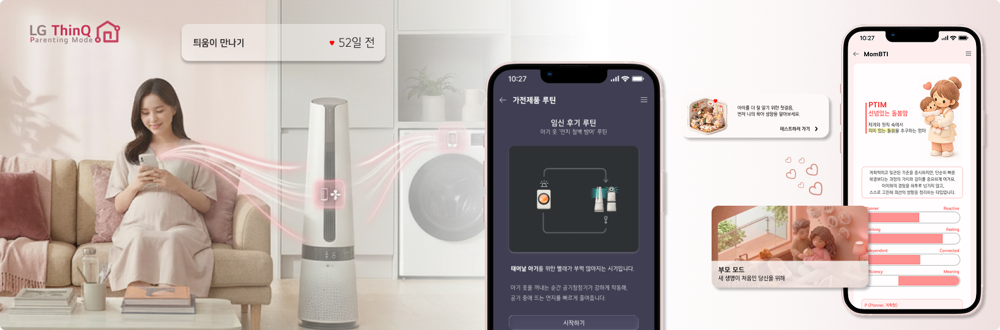
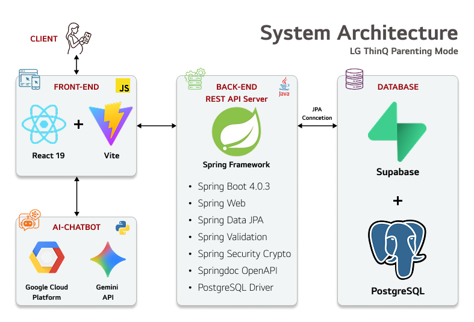

# LG ThinQ Parenting Mode

> 공간 제어를 넘어 첫 만남을 준비하는 여정까지, ThinQ로 연결된 임신·출산 라이프

**LG전자 DX School 4기 2반 4팀 Last Dance**

---

## 1. 서비스 정의

### 컨셉

예비 부모를 위한 맞춤형 All-in-One 케어 서비스입니다. AI 챗봇으로 출산 정보를 쉽게 얻고, MomBTI로 성향을 파악해 같은 유형의 예비맘 커뮤니티에서 소통하며 불안감을 해소합니다. 부부 공유 기능과 임산부 맞춤 가전 루틴으로 ThinQ만의 특별한 임신·출산 여정을 완성합니다.

참고 URL : [서비스 및 팀구성원 소개 링크](https://junhongkim95.github.io/LG-ThinQ-ParentingMode-Portfolio/)

### 핵심 가치

| 구분 | 내용 |
|------|------|
| **First** | 파편화된 피로를 지우는 '최고의' 원스톱 케어. 수많은 임신/육아 앱과 가전 리모컨 앱을 오가며 했던 예비맘의 피로감을 줄이고 최고 수준의 편의성을 제공 |
| **Unique** | 정보와 공간이 완벽히 동기화된 융합 서비스. 산모의 임신 주차와 컨디션에 맞춰 에어컨, 공기청정기 등 LG 가전이 알아서 최적의 물리적 환경을 세팅 |
| **New** | 280일의 감정까지 어루만지는 '세상에 없던' 공감 플랫폼. MomBTI로 산모의 성향을 파악하고, 비슷한 성향의 엄마들과 연결해 깊은 정서적 공감대를 형성 |

### 타겟 고객

- **핵심 타겟**: 임신 초기부터 출산 전까지의 임산부 (특히 초산모 및 정보 탐색 부담이 큰 예비 부모)
- **Pain Point**: 정보 파편화, 감정 케어 부재, 통합 관리 부재

### 주요 고객 접점 (Touch Point)

| 접점 | 기능 |
|------|------|
| 부모모드 홈 | 임신 주차·D-DAY, 주차별 To-Do, 남편 응원 메시지, 추천 가전 루틴 카드 |
| 가전 제어 | 에어컨·공기청정기 맞춤 모드, 알림음 제어, 시기별 자동화 루틴 |
| 공유·기록 | 가족 공유 캘린더·체크리스트, 사진 첨부 임신 일기, 사회 |
| 커뮤니티 | MomBTI·마미말 필터링 게시판, 경험 공유 공간 |
| AI 챗봇 | 홈에서 즉시 접근, 증상별·주차별 맞춤 질의응답 인터페이스 |

---

## 2. 프로젝트 구조

```
thinq-parent/
├── thinq-parent-frontend/          # 프론트엔드
│   ├── src/
│   │   ├── App.jsx                 # 메인 라우팅 (2,700+ lines)
│   │   ├── config/api.js           # API 설정
│   │   ├── data/                   # 정적 데이터 (추천 할일, 문항 등)
│   │   └── features/
│   │       ├── parent/             # 부모모드 홈, 가전제어, 일정 (7개 화면)
│   │       ├── diary/              # 임신 일기 (3개 화면)
│   │       ├── community/          # 커뮤니티 (3개 화면)
│   │       ├── mombti/             # 맘BTI 검사 (4개 화면)
│   │       └── my/                 # MY 페이지 (2개 화면)
│   ├── assets/                     # 아이콘, 이미지 (107개 파일)
│   └── chatbot/                    # AI 챗봇 (Gemini API)
│
├── thinq-parent-backend/           # 백엔드
│   ├── src/main/java/.../
│   │   ├── appliance/              # 가전 제어
│   │   ├── cheermessage/           # 응원 메시지
│   │   ├── community/              # 커뮤니티
│   │   ├── familygroup/            # 가족 그룹
│   │   ├── mombti/                 # 맘BTI
│   │   ├── mylist/                 # 나만의 할 일
│   │   ├── pregnancydiary/         # 임신 일기
│   │   ├── recommandlist/          # 추천 할 일
│   │   ├── schedule/               # 일정 관리
│   │   ├── todo/                   # 추천 할 일 마스터
│   │   ├── user/                   # 사용자
│   │   ├── health/                 # 헬스체크
│   │   └── common/                 # 공통 (API응답, 예외처리, 설정)
│   └── supabase-postgres-schema.sql # DB 스키마
│
└── README.md
```

---

## 3. 기술 스택

| 구분 | 기술 | 버전 |
|------|------|------|
| **Frontend** | React + Vite | React 19.2, Vite 7.3 |
| **Frontend 언어** | JavaScript (ES Module, JSX) | - |
| **Backend** | Spring Boot | 4.0.3 |
| **Backend 언어** | Java | 21 |
| **ORM** | Spring Data JPA / Hibernate | - |
| **API 문서** | SpringDoc OpenAPI (Swagger UI) | 3.0.2 |
| **검증** | Spring Validation | - |
| **보안** | Spring Security Crypto | - |
| **Database** | PostgreSQL | 17.6 |
| **DB 호스팅** | Supabase (AWS ap-northeast-1) | - |
| **파일 저장소** | Supabase Storage | - |
| **AI 챗봇** | Google Gemini API | GCP Cloud Run |
| **챗봇 서버** | Python | GCP 배포 |
| **와이어프레임** | Figma | - |

---

## 4. 시스템 아키텍처
계층형 아키텍처 (Layered Architecture)를 적용하여 관심사를 분리하였습니다.


| 계층 | 역할 | 통신 |
|------|------|------|
| **Client (Frontend)** | UI 렌더링, 사용자 인터랙션, API 호출 | HTTP/JSON → Backend |
| **Backend (REST API)** | 비즈니스 로직, 데이터 검증, CRUD | JDBC/SSL → Database |
| **Database (Supabase)** | 데이터 저장, 파일 스토리지 | 클라우드 호스팅 |
| **AI Chatbot (GCP)** | 임산부 특화 질의응답 | Client에서 직접 호출 |

---

## 5. 프론트엔드 (Frontend)

### 실행 방법

```bash
cd thinq-parent-frontend
npm install
npm run dev
```

### 주요 기능 및 화면 구성

하단 네비게이션 4개 탭(홈, 가전육아, 커뮤니티, MY) + AI 챗봇으로 구성됩니다.

#### 1) 홈 — 부모모드 대시보드
- **부모모드 홈**: 출산 D-DAY 카운트다운, 현재 임신 주차 기반 주간 추천 할 일 카드, 배우자 응원 메시지 최신 1건 표시, 추천 가전 루틴 바로가기 카드
- **응원 메시지**: 가족 그룹 내 배우자 간 응원 메시지 전송 및 조회

#### 2) 가전육아 — 스마트 가전 제어
- **가전육아 메인**: 가전제품 자동제어 ON/OFF 토글, 가전 알림음 제어 ON/OFF 토글, 가전제품 루틴 바로가기
- **루틴 목록**: 임신 초기/중기/후기 3개 루틴 카드 표시
- **초기 루틴 상세**: "수면 방해 차단 '올 무음' 루틴" — 4개 가전(세탁기, 건조기, 로봇청소기, 공기청정기) 동작 설명 + 시작하기
- **중기 루틴 상세**: "허리 굽힘 제로 '노터치' 세탁 루틴" — 4개 가전 동작 설명 + 시작하기
- **후기 루틴 상세**: "아기 옷 '먼지 철벽 방어' 루틴" — 4개 가전 동작 설명 + 시작하기

#### 3) 커뮤니티 — 예비맘 소통 공간
- **게시판 목록**: 게시판별 탭(전체 / 임신 수다 / 정보·고민), 7개 키워드 필터(증상기록, 아기상태, 진료정보, 건강관리, 출산준비, 사회지원, 감정기록), 맘BTI 동일 유형 게시글 필터, 게시글 미리보기(제목, 본문 요약, 좋아요·댓글 수, 작성자 맘BTI 유형)
- **게시글 상세**: 본문 전체 보기, 작성자 맘BTI 유형 표시, 댓글 조회·작성·수정·삭제, 좋아요 토글(재진입 시에도 상태 유지)
- **글 작성/수정**: 게시판·키워드 선택, 제목·본문 입력, 익명 여부 설정

#### 4) MY — 마이페이지
- **MY 메인**: 사용자 프로필(태명, 임신 주차), 임신 일기 / 맘BTI / 일정 / 할 일 바로가기
- **아이 프로필**: 태명 수정, 출산 예정일 변경

#### 5) 맘BTI — 임산부 성향 검사
- **맘BTI 메뉴**: 검사 소개, 시작하기 / 결과 보기 분기
- **검사 진행**: 24개 문항(6문항씩 4페이지), 5점 척도 선택
- **결과 상세**: 16개 유형 중 결과 유형 표시, 유형별 특성·강점·약점 분석
- **최근 결과**: 마지막 완료된 검사 결과 조회 (COMPLETED 상태만)

#### 6) 임신 일기 — 부부 공유 일기
- **일기 목록**: 같은 가족 그룹의 일기 목록(페이지네이션, 썸네일, 작성자 구분)
- **일기 상세**: 일기 본문 + 첨부 이미지 보기, 수정·삭제(본인 글만)
- **일기 작성/수정**: 제목, 본문, 날짜 입력, 사진 촬영·앨범 선택(Supabase Storage 업로드)

#### 7) 일정 관리 — 캘린더 & 할 일
- **일정 캘린더**: 월별 캘린더 뷰(일정 있는 날짜 마커 표시), 일별 일정 목록 조회, 나만의 할 일(투두) 목록 조회 + 체크·해제
- **일정 등록/수정**: 제목, 메모, 날짜, 시간, 유형 선택(아기 / 가족 / 업무 / 개인 / 중요 / 기타)

#### 8) AI 챗봇 — 임산부 전문 상담
- **채팅 화면**: 플로팅 버튼으로 진입, 임산부 건강·증상·영양·출산 준비 등 질의응답, Google Gemini API 기반 실시간 응답

### 네비게이션 구조

```
ThinQ 홈 → 설정 → 라이프 에이전트 → 부모모드
│
├── [홈] 부모모드 대시보드
│   ├── D-DAY, 주간 추천 할 일
│   ├── 배우자 응원 메시지
│
├── [가전육아] 스마트 가전 제어
│   ├── 가전제품 자동제어 ON/OFF
│   ├── 가전 알림음 제어 ON/OFF
│   └── 가전제품 루틴 (초기 / 중기 / 후기)
│
├── [커뮤니티] 예비맘 소통 공간
│   ├── 게시판별 / 키워드별 / 맘BTI 필터
│   ├── 게시글 상세 (댓글, 좋아요)
│   └── 글 작성/수정
│
├── [MY] 마이페이지
│   ├── 아이 프로필 (태명, 출산 예정일)
│   ├── 맘BTI 검사 → 결과 조회
│   ├── 임신 일기 → 목록 → 상세 → 작성/수정
│   ├── 일정 캘린더 → 등록/수정
│   └── 나만의 할 일 (투두 체크리스트)
│
└── [AI 챗봇] 플로팅 버튼 → Gemini 임산부 상담
```

---

## 6. 백엔드 (Backend)

### 실행 방법

```bash
cd thinq-parent-backend
./gradlew bootRun
```

- 서버 포트: `8081`
- Swagger UI: `http://localhost:8081/swagger-ui.html`

### API 모듈 구성 (13개 컨트롤러, 80+ 엔드포인트)

| 모듈 | Base Path | 주요 기능 |
|------|-----------|-----------|
| 사용자 | `/api/v1/users` | 회원 CRUD, 임신 주차 조회, 출산 예정일 관리 |
| 가족 그룹 | `/api/v1/family-groups` | 그룹 생성, 초대 코드 기반 참여 |
| 임신 일기 | `/api/pregnancy-diaries` | 일기 CRUD, 이미지 업로드 (Supabase Storage) |
| 일정 관리 | `/api/v1/schedules` | 월별/일별 일정 조회, 출산 예정일 자동 관리 |
| 나만의 할 일 | `/api/v1/my-list` | 투두 리스트 CRUD, 완료 여부 관리 |
| 추천 할 일 | `/api/v1/todos` | 임신 주차별 맞춤 추천 할 일 |
| 추천 목록 | `/api/v1/recommand-list` | 주차별 추천 항목 체크 관리 |
| 맘BTI 검사 | `/api/v1/mombti` | 24문항 성격 유형 검사 (16개 결과 유형) |
| 커뮤니티 | `/api/v1/community` | 게시글/댓글/좋아요, 게시판/키워드 분류, 맘BTI 필터 |
| 응원 메시지 | `/api/v1/cheer-messages` | 가족 간 응원 메시지 전송 |
| 가전 제어 | `/api/appliance-controls` | 루틴 선택/변경, 자동제어 토글, 알림음 제어 |
| 헬스체크 | `/api/v1/health` | 서버/DB 상태 확인 |

### 가전 제어 API 상세

임신 시기별 가전 루틴을 관리하는 핵심 차별 기능입니다.

| Method | Endpoint | 기능 |
|--------|----------|------|
| `POST` | `/api/appliance-controls` | 최초 루틴 선택 (4개 가전 등록) |
| `PATCH` | `/api/appliance-controls/routine` | 루틴 변경 (초기→중기→후기) |
| `GET` | `/api/appliance-controls` | 내 가전 제어 상태 조회 |
| `GET` | `/api/appliance-controls/{id}` | 개별 가전 상세 조회 |
| `PATCH` | `/api/appliance-controls/routine-activation` | 가전제품 자동제어 ON/OFF |
| `PATCH` | `/api/appliance-controls/alert-sound-all` | 전체 알림음 일괄 ON/OFF |
| `PATCH` | `/api/appliance-controls/{id}/alert-sound` | 개별 알림음 ON/OFF |
| `GET` | `/api/appliance-controls/routines` | 루틴 목록 조회 (3개) |

### 코드 규모

| 구분 | 파일 수 |
|------|--------|
| Controller | 13개 |
| Service (인터페이스 + 구현체) | 27개 |
| Repository | 23개 |
| Domain (Entity) | 23개 |
| DTO (Request/Response) | 58개 |
| **합계** | **144개** |

---

## 7. 데이터베이스 (Database)

### 구성

| 항목 | 내용 |
|------|------|
| DBMS | PostgreSQL 17.6 |
| 호스팅 | Supabase (AWS ap-northeast-1) |
| 테이블 수 | 23개 |
| DDL 전략 | validate (엔티티-스키마 정합성 검증) |
| 파일 저장소 | Supabase Storage (임신 일기 이미지, Signed URL 방식) |

### ERD 도메인 구성

```
┌─────────────────────────────────────────────────────────────────┐
│                                                                 │
│   [임신일기]            [핵심]                [커뮤니티]          │
│   diary_images         users ◄────► family    boards            │
│       ↓               groups                 keywords           │
│   diaries                                      ↓                │
│                                              posts              │
│   [할일]            [일정/응원]              ↙    ↘             │
│   todos            schedules            comments  likes         │
│   my_list          cheer_messages                               │
│   recommand_list                                                │
│                                                                 │
│   [맘BTI]                [AI]             [가전제어]             │
│   question            ai_chat_logs       appliance_master       │
│   choice                                 routine_master         │
│   result_profile                         routine_action         │
│   test_attempt                           user_appliance_control │
│   answer                                                        │
│                                                                 │
└─────────────────────────────────────────────────────────────────┘
```

### 테이블 목록 (23개)

| 도메인 | 테이블 | 설명 |
|--------|--------|------|
| 핵심 | `users` | 사용자 (이메일, 태명, 출산예정일, 임신주차) |
| 핵심 | `family_groups` | 가족 그룹 (초대코드 기반) |
| 임신일기 | `pregnancy_diaries` | 임신 일기 (부부 공유) |
| 임신일기 | `pregnancy_diary_images` | 일기 첨부 이미지 |
| 할일 | `todos` | 추천 할 일 마스터 (주차별) |
| 할일 | `my_list` | 나만의 할 일 |
| 할일 | `recommand_list` | 추천 할 일 체크 목록 |
| 맘BTI | `mombti_question` | 검사 문항 (24개) |
| 맘BTI | `mombti_choice` | 문항별 선택지 (120개) |
| 맘BTI | `mombti_result_profile` | 결과 유형 프로필 (16개) |
| 맘BTI | `mombti_test_attempt` | 검사 시도 기록 |
| 맘BTI | `mombti_answer` | 문항별 답변 기록 |
| 커뮤니티 | `boards` | 게시판 마스터 (임신수다, 정보/고민) |
| 커뮤니티 | `community_keywords` | 키워드 마스터 (7개) |
| 커뮤니티 | `community_posts` | 게시글 |
| 커뮤니티 | `community_comments` | 댓글 |
| 커뮤니티 | `community_post_likes` | 좋아요 |
| 일정 | `schedules` | 일정 (6개 유형: 아기/가족/업무/개인/중요/기타) |
| 응원 | `cheer_messages` | 가족 간 응원 메시지 |
| 가전제어 | `appliance_master` | 가전 마스터 (4종) |
| 가전제어 | `routine_master` | 루틴 마스터 (초기/중기/후기) |
| 가전제어 | `routine_action` | 루틴별 가전 동작 정의 (12개) |
| 가전제어 | `user_appliance_control` | 사용자별 가전 제어 상태 |

### 스키마 파일

- `supabase-postgres-schema.sql` — 전체 DB 스키마 + 시드 데이터
- `appliance_mvp.sql` — 가전 제어 테이블 독립 스키마

---

## 8. 팀 구성

### 팀명: Last Dance

**LG전자 DX School 4기 2반 4팀**

<table>
  <tr>
    <td align="center" width="20%"></td>
    <td align="center" width="20%"></td>
    <td align="center" width="20%"></td>
    <td align="center" width="20%"></td>
    <td align="center" width="20%"></td>
  </tr>
  <tr>
    <td align="center"><b>팀장 김준홍</b></td>
    <td align="center"><b>팀원 박성원</b></td>
    <td align="center"><b>팀원 박하은</b></td>
    <td align="center"><b>팀원 송상준</b></td>
    <td align="center"><b>팀원 이도한</b></td>
  </tr>
  <tr>
    <td align="center">기획·데이터분석</td>
    <td align="center">데이터 분석</td>
    <td align="center">디자인 기획</td>
    <td align="center">프론트엔드</td>
    <td align="center">백엔드</td>
  </tr>
</table>
